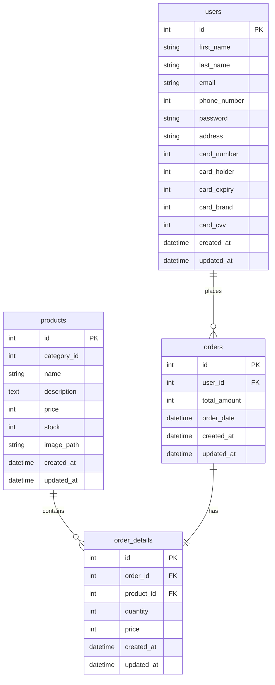

釣り具（ルアー）のECサイトです。
URL: https://cryptic-anchorage-66912-5fa7249bc29d.herokuapp.com/
管理者画面：　https://cryptic-anchorage-66912-5fa7249bc29d.herokuapp.com/admin

## 画面・機能説明

### 1. ユーザー向け機能
- **ホーム画面(/)**
  - 商品一覧の表示
  - カテゴリー別商品検索

- **商品一覧画面(/products)**
  - 商品の詳細情報表示
  - カートへの追加機能
  
- **商品詳細画面(/products/id)**
  - 商品の詳細情報表示
  - カートへの追加機能
  
- **ログイン/会員登録画面(/login, /register)**
  - ユーザー認証
  - 新規会員登録

 - **マイページ(/mypage)**
  - ユーザー情報確認
  - プロフィール・パスワード変更

- **カート機能(/cart)**
  - 商品の追加/削除
  - 数量の変更
  - 合計金額の表示

### 2. 管理者向け機能
- **商品管理(/admin/products)**
  - 商品の登録/編集/削除
  - 在庫管理
  
- **注文管理(/admin/orders)**
  - 注文一覧の確認
  - 注文状況の更新
  
- **ユーザー管理(/admin/users)**
  - 会員情報の確認
  - 会員状態の管理

## 使用技術

### バックエンド
- PHP 8.2
- MySQL 8.0

### インフラ・開発環境
- Heroku
- JawsDB（MySQL）
- Git/GitHub
- Composer（パッケージ管理）

### 主要ライブラリ
- dotenv（環境変数管理）
- PDO（データベース操作）

## ER図

